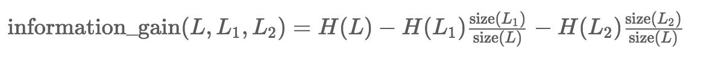

# Definitions #

Given a group of values, the entropy of the group is defined as the formula as following:

where *P(x)* is the probability of appearance for the value *x*.

e.g.

the input group: *[1, 1, 2, 2]*

the probability of value 1 is:  2/4 = 1/2

the probability of value 2 is:  2/4 = 1/2

Therefore, its entropy can be obtained by: *- (1/2) * log2(1/2) - (1/2) * log2(1/2) = 1/2 + 1/2 = 1*

This exercise, however, is aimed to calculate the maximum *information gain* that one can obtain by splitting a group into two subgroups. The information gain is the difference of entropy before and after the splitting.

For a group of *L*, we divide it into subgroups of *{L1, L2}*, then the information gain is calculated as following:

The overall entropy of the splitted subgroups {L1, L2} is the sum of entropy for each subgroup weighted by its proportion with regards to the original group.

# Problem Description #
 
In this exercise, one can expect a list of samples on Iris flowers. Each sample is represented with a tuple of two values: *<petal_length, species>*, where the first attribute is the measurement on the length of the petal for the sample, and the second attribute indicates the species of sample. Here is an example.

The task is to split the sample list into two sublists, while complying with the following two conditions:

1. The *petal_length* of sample in one sublist is less or equal than that of any sample in the other sublist.

2. The information gain on the *species* attribute of the sublists is maximal among all possible splits.

As output, one should just return the information gain.

In addition, one can expect that each value of *petal_length* is unique.  

In the above example, the optimal split would be L1 = [(0.5, 'setosa'), (1.0, 'setosa')] and L2 = [(1.5, 'versicolor'), (2.3, 'versicolor')]. According the above formulas, the maximum information gain for this example would be 1.0.

Note:  For certain languages (e.g. Java), there is no build-in type of tuple. As a reuslt, to make the input more general, we decompose the input into two lists: *[petal_length]* *[species]* respectively, where the petal_length would be of float value and the species is of string. The elements in the petal_length list and species list are associated to each other one by one by order.
 